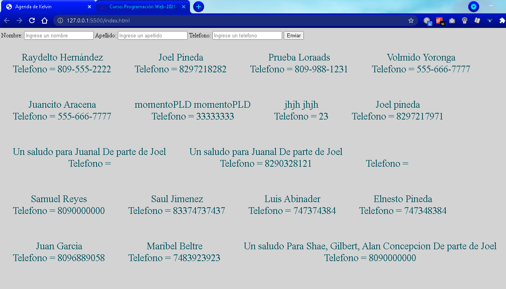

# Tarea 3 - Agenda
Este proyecto es una agenta que permite ver y añadir contactos usando funciones como fetch, post y get de JS. Es una asignación de el ITLA en su cuatrimestre 2021 - C - 2. Construida en HTML5, CSS3 y JS (ES5).

Captura del programa;

